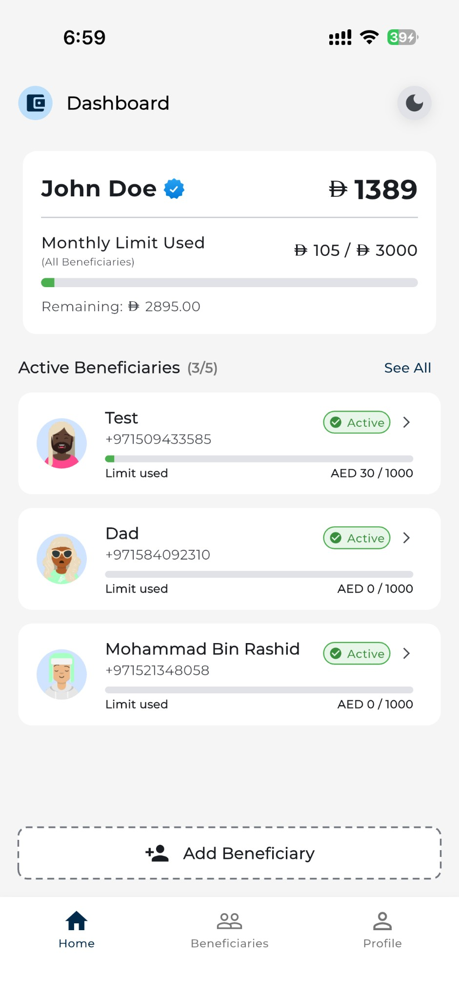
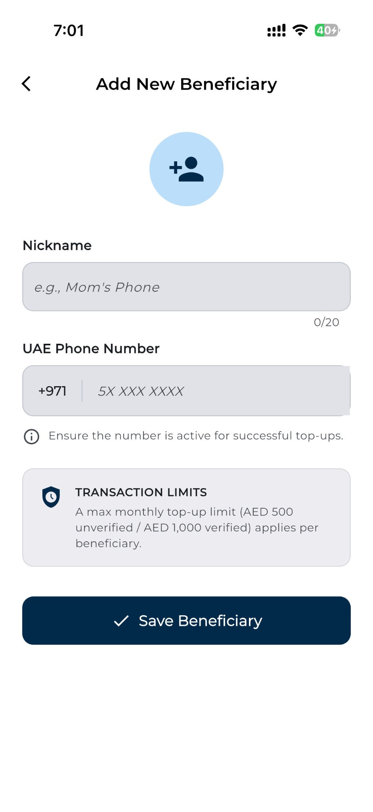
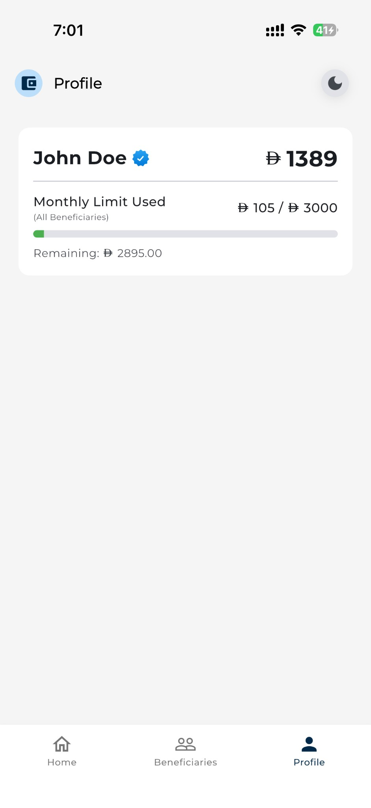
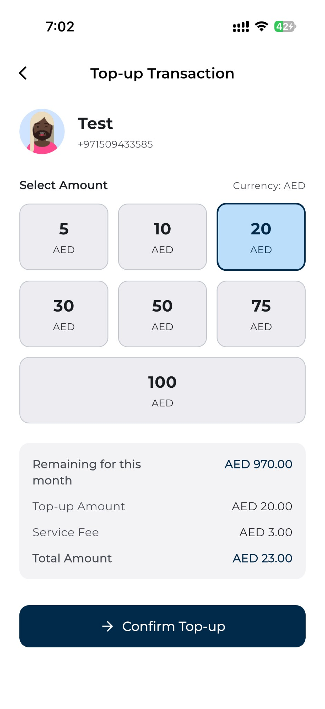
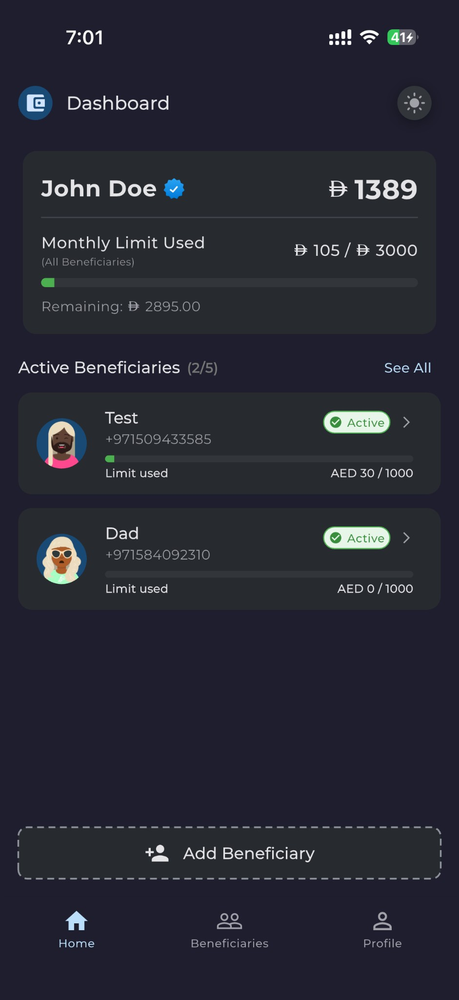
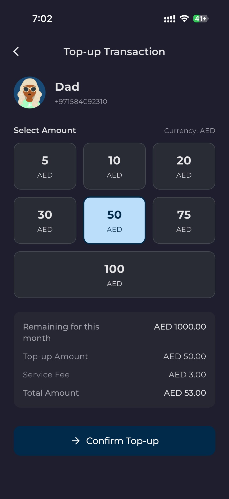
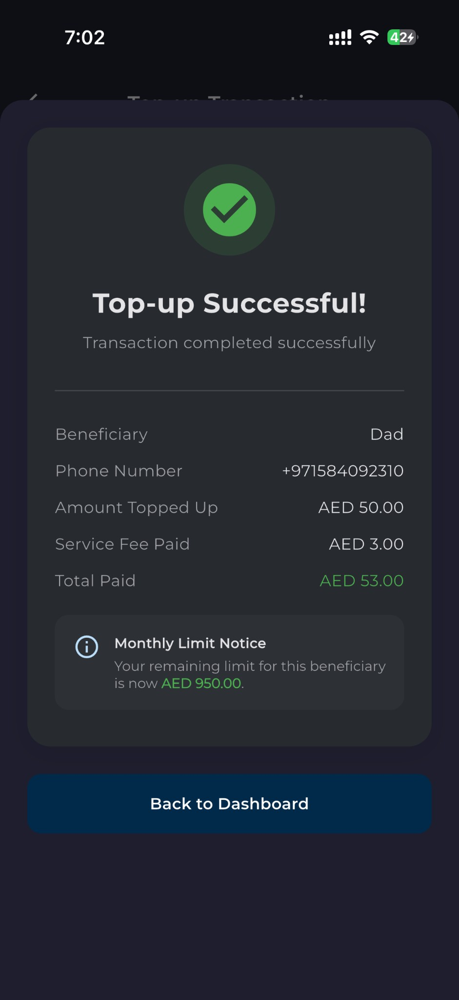

# UAE Mobile Top-up App

[](https://flutter.dev)
[](https://dart.dev)
[](LICENSE)

A production-ready Flutter application for managing mobile phone top-up beneficiaries and transactions in the UAE. Built with Clean Architecture, comprehensive testing (116 tests), and modern Flutter best practices.

## Description

This mobile app enables users to manage mobile phone top-up beneficiaries and perform secure top-up transactions with comprehensive business rule enforcement.

### Key Features
- **User Management**: Balance tracking, verification status, and monthly limit monitoring
- **Beneficiary Management**: Add up to 5 active beneficiaries with UAE phone number validation
- **Top-up Operations**: 7 predefined amounts (AED 5-100) with AED 3 service charge
- **Business Rules**: Automated enforcement of monthly limits (per-beneficiary and total)
- **Offline Support**: Local caching with SharedPreferences for offline capability
- **Transaction History**: Complete audit trail with monthly/beneficiary filtering

---

## Tech Stack

### Core
- **Flutter SDK**: 3.32.4 (Stable)
- **Dart SDK**: 3.8.1

---

## Clean Architecture

This app follows **Clean Architecture** with a **feature-based structure**. Each feature contains its own domain, data, and presentation layers.

```
lib/
├── core/                              # Shared utilities and components
│   ├── constants/                     # App-wide constants
│   ├── errors/                        # Custom exceptions
│   ├── theme/                         # Theme configuration
│   ├── utils/                         # Utilities (formatters, loggers, helpers)
│   └── widgets/                       # Reusable widgets
│
├── data/                              # Shared data layer
│   └── datasources/
│       └── mock_http_client.dart      # Mock HTTP for development
│
├── features/                          # Feature modules (Clean Architecture)
│   │
│   ├── user/                          # User feature
│   │   ├── data/                      # Data sources & repositories
│   │   ├── domain/                    # Entities, repositories, use cases
│   │   └── presentation/              # BLoC, screens, widgets
│   │
│   ├── beneficiary/                   # Beneficiary feature
│   │   ├── data/                      # Data sources & repositories
│   │   ├── domain/                    # Entities, repositories, use cases
│   │   └── presentation/              # BLoC, screens, widgets
│   │
│   └── topup/                         # Top-up feature
│       ├── data/                      # Data sources & repositories
│       ├── domain/                    # Entities, repositories, use cases
│       └── presentation/              # BLoC, screens, widgets
│
├── screens/                           # Main navigation
├── dependency_injection.dart          # Service locator (get_it)
└── main.dart                          # App entry point
```

### Design Patterns
- **Clean Architecture**: Three-layer separation (Domain, Data, Presentation)
- **BLoC Pattern**: State management with flutter_bloc
- **Repository Pattern**: Abstract data sources from business logic
- **Dependency Injection**: Service locator with get_it
- **SOLID Principles**: Maintainable and testable code

---

## Test Structure

**116 comprehensive tests** covering all critical functionality:

```
test/
├── core/                              # Core utilities tests
│   ├── errors/                        # Exception tests
│   └── utils/                         # Utility tests (formatters, helpers)
│
└── features/                          # Feature tests
    ├── user/                          # User feature tests
    │   ├── data/                      # Data layer tests
    │   ├── domain/                    # Use cases & entities tests
    │   └── presentation/              # BLoC & widget tests
    │
    ├── beneficiary/                   # Beneficiary feature tests
    │   ├── data/                      # Data layer tests
    │   ├── domain/                    # Use cases tests
    │   └── presentation/              # BLoC & widget tests
    │
    └── topup/                         # Top-up feature tests
        ├── data/                      # Data layer tests
        ├── domain/                    # Use cases & entities tests
        └── presentation/              # BLoC & widget tests
```

### Test Coverage
- **Unit Tests**: 21 test files (~106 tests)
  - Core utilities, exceptions, entities, use cases, data sources, repositories
- **Widget Tests**: 5 test files (~10 tests)
  - BLoC integration tests, UI component tests

---

## Assumptions Made

1. **Monthly Reset Logic**
   - Monthly limits reset on the 1st day of each month
   - Reset happens automatically when data is fetched
   - Previous month's usage is cleared

2. **Phone Number Validation**
   - Accepts UAE format: +971XXXXXXXXX (13 digits total)
   - Also accepts: 05XXXXXXXX (10 digits total)
   - Other formats are rejected

3. **Mock Backend**
   - HTTP client simulates network delays (300-1000ms)
   - 5% chance of random network errors for testing
   - Data persists in local cache between sessions

4. **User Verification**
   - Verification status comes from backend (not editable in app)
   - Affects per-beneficiary monthly limits
   - Hardcoded in mock data (can be changed for testing)

5. **Transaction Charges & Limit Calculation**
   - Fixed AED 3 charge per transaction
   - Total cost = Top-up amount + AED 3 fee
   - Fee deducted from user balance but NOT counted toward monthly limits
   - Monthly limits apply only to the top-up amount sent to beneficiaries
   - Example: AED 50 top-up costs AED 53, but only AED 50 counts toward limits

6. **Data Persistence**
   - User and beneficiary data cached locally
   - Cache used as fallback when network fails
   - Transaction history stored locally for audit trail
   - Transactions tracked by month and beneficiary for limit enforcement

7. **Money Handling**
   - Amounts stored as double type representing AED
   - All predefined amounts are whole numbers (5, 10, 20, 30, 50, 75, 100)
   - Service charge is AED 3.00 (whole number)
   - This minimizes floating-point precision issues

8. **UI/UX Decisions**
   - Pull-to-refresh for manual data reload
   - Inline validation with helpful error messages
   - Confirmation dialogs for destructive actions
---

## Installation & Setup

### Prerequisites
- **Flutter SDK**: 3.32.4 or higher
- **Dart SDK**: 3.8.1 or higher
- **IDE**: Android Studio, VS Code, or IntelliJ with Flutter/Dart plugins
- **Platform**: iOS Simulator, Android Emulator, or Physical Device

### Setup Steps

**1. Clone the repository**
```bash
git clone https://github.com/Snehal-iOS/uae_topup_app.git
cd uae_topup_app
```

**2. Verify Flutter installation**
```bash
flutter doctor -v
```

**3. Install dependencies**
```bash
flutter pub get
```

**4. Generate mock files for testing**
```bash
dart run build_runner build --delete-conflicting-outputs
```

**5. Run the app**
```bash
# List available devices
flutter devices

# Run on first available device
flutter run

# Run in release mode (better performance)
flutter run --release
```

### Troubleshooting

**Build runner fails:**
```bash
flutter clean
flutter pub get
dart run build_runner build --delete-conflicting-outputs
```

**Tests fail to run:**
```bash
dart run build_runner build
flutter test
```

**Flutter command not found:**
```bash
# Add Flutter to PATH (macOS/Linux)
export PATH="$PATH:/path/to/flutter/bin"

# Make it permanent
echo 'export PATH="$PATH:/path/to/flutter/bin"' >> ~/.zshrc
source ~/.zshrc
```

---

## Running Tests

### Run all tests
```bash
flutter test
```

### Run tests with coverage
```bash
flutter test --coverage
```

### Run specific test file
```bash
flutter test test/features/topup/domain/usecases/perform_topup_usecase_test.dart
```

### Run tests with verbose output
```bash
flutter test --verbose
```

### Generate HTML coverage report
```bash
# Install lcov (macOS)
brew install lcov

# Generate report
genhtml coverage/lcov.info -o coverage/html

# Open in browser
open coverage/html/index.html
```

### Understanding Test Output

When running tests, you may see error logs and stack traces - **this is expected behavior**! These appear when testing error handling scenarios. For example:

```
   ERROR: Failed to perform top-up
   Error: Invalid amount
   Stack: [stack trace...]
```

This appears in tests like `should throw ValidationException when amount is zero`. The test intentionally triggers the error to verify proper handling.

**All 116 tests pass successfully**

---

## Screenshots

### Light Theme

<table>
  <tr>
    <td align="center"><b>Dashboard</b></td>
    <td align="center"><b>Add New Beneficiary</b></td>
    <td align="center"><b>Manage All Beneficiaries</b></td>
  </tr>
  <tr>
    <td></td>
    <td></td>
    <td></td>
  </tr>
</table>

<table>
  <tr>
    <td align="center"><b>Profile</b></td>
    <td align="center"><b>Top-up Transaction</b></td>
    <td align="center"><b>Top-up Success</b></td>
  </tr>
  <tr>
    <td></td>
    <td></td>
    <td></td>
  </tr>
</table>

### Dark Theme

<table>
  <tr>
    <td align="center"><b>Dashboard</b></td>
    <td align="center"><b>Top-up Transaction</b></td>
    <td align="center"><b>Top-up Success</b></td>
  </tr>
  <tr>
    <td></td>
    <td></td>
    <td></td>
  </tr>
</table>

---

## License

MIT License

Copyright (c) 2026

---

## Contact

For questions or issues, please open an issue on GitHub.

---

**Built by snehal using Flutter**
